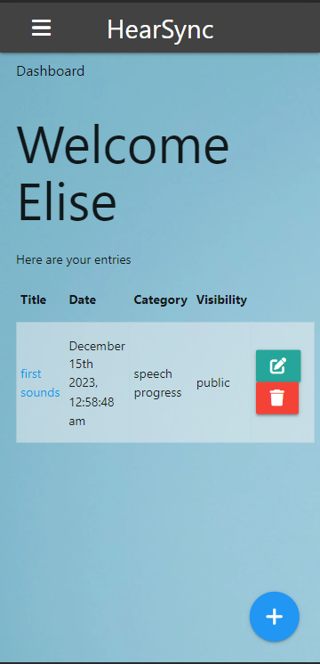

# HearSync

With parents who have childern with hearing loss in mind, this app will help organize speech progression and help keep track of hearing device maintainence.

  

**Link to project:** [https://hearsync.onrender.com/](https://hearsync.onrender.com/)

## How It's Made:

**Tech used:** HTML, CSS, JavaScript, React\*, Materialize, Handlebars

This is server-side rendered using the MERN stack, including Mongoose. The front-end was developed using Materialze and Handlebars as a template engine.

## Optimizations

Right now the hosted version of this app is broken due to Google Auth issues that are currently in the process of being debugged.

If you would like to access the full app, please free to use http://localhost:3000

\*I built the hearing device separately using React and will integrate it into this applicatation when I'm finished builing the server-side of the tracker app.

I also need to play with the imaging for a more professional look.

## Lessons Learned:

Test code more often before pushing to my GitHub account to save time from debugging.
